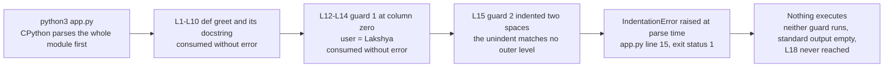

# child_repo_10_LOC

**Contents**

- [Overview and Repository Composition](#overview-and-repository-composition)
- [Setup Instructions](#setup-instructions)
- [API Documentation](#api-documentation)
- [Deployment Guide](#deployment-guide)
- [Inline Code Explanations](#inline-code-explanations)
- [Known Issues](#known-issues)
- [Related Repositories](#related-repositories)

## Overview and Repository Composition

`child_repo_10_LOC` is the **child**: the middle of the three repositories joined by Git submodule links in this project. Its tracked project content is one Python module, this README, and one submodule declaration, beside the gitlink that points at the **nested child**.

```text
child_repo_10_LOC/
├── README.md
├── app.py
├── .gitmodules
└── nested_child_repo_10_LOC/
```

This repository is **consumed as a submodule by the apex repository, `parent_repo_10_LOC`**, which records it as a **gitlink**: a tree entry with Git mode `160000` whose value is a single commit SHA of this repository rather than a file blob, so a composed checkout receives exactly the commit that pin names. The pin advances whenever the apex re-stages the `child_repo_10_LOC` path after a new commit is made here, which committing this documentation does, so read the recorded value from the apex with `git ls-tree HEAD child_repo_10_LOC`; the pin recorded before this documentation was added is `5687ef6c3fdbdf361df830fcd78a2dbdcdb2b80a`.

This repository in turn **consumes the nested child, `nested_child_repo_10_LOC`**, through a gitlink of the same kind, declared in the `.gitmodules` file reproduced under Setup Instructions below and checked out at the path `nested_child_repo_10_LOC/`. Read the pin recorded here with `git ls-tree HEAD nested_child_repo_10_LOC`; it currently names `c5250c8affe7a0afe46b782895fd17a4cbae105a`, and the pin recorded before this documentation was added is `687f60b6c74818ac7cd14413840d73fdfb5fe450`.

This repository is also **independently cloneable** from the URL the apex declares for it, `https://github.com/lakshya-blitzy/child_repo_10_LOC.git`.

`app.py` holds the whole of this repository's code: one function and two script-entry guards `[app.py:L1-L18]`. The three programs in the composition are **independent, with no runtime coupling between the levels**. Nothing here imports, invokes, or is invoked by the apex JavaScript program or the nested child's Java program, and the only interface any of the three exposes is standard output.

## Setup Instructions

Setup is acquisition only. No file in this repository declares a dependency — there is no dependency manifest at any level of the composition — so nothing is installed beyond the interpreter named below.

### Prerequisites

| Prerequisite | Version floor | Evidence |
|---|---|---|
| CPython | 3.6 or later | The f-string at `[app.py:L10]`, the only construct in the module that implies a version floor |

Nothing in the composition declares a Python version or a toolchain version, so **no concrete interpreter version is asserted here**. 3.6 is the floor the source itself implies, because that is the release in which f-strings became available. That is a statement about the language level alone, and **not** a statement that the module runs — it does not. The mis-indented guard at `[app.py:L15]` stops it parsing under any interpreter, and the measured failure is recorded under Deployment Guide and Known Issues below.

Node.js is a prerequisite of the apex repository only, and a JDK of the nested child only. Neither is a prerequisite of this repository, and neither is restated here.

### Standalone acquisition

```bash
git clone https://github.com/lakshya-blitzy/child_repo_10_LOC.git
```

That clone leaves `nested_child_repo_10_LOC/` empty, because cloning does not populate submodules. Initialize it from inside the clone:

```bash
git submodule update --init --recursive
```

Acquiring both in one step has the same result:

```bash
git clone --recurse-submodules https://github.com/lakshya-blitzy/child_repo_10_LOC.git
```

Each submodule hop is a separate fetch against a separate remote, so the network must reach `github.com` once for this repository and once again for the nested child.

Beside the tracked content listed above, a checkout also carries Git's own metadata, which is not project content: a `.git` directory in a standalone clone, and a `.git` file holding a `gitdir:` pointer when this repository is checked out as a submodule of the apex.

### The nested child's submodule declaration

`.gitmodules` in this repository is the authoritative declaration of the nested child's submodule name, checkout path, and clone URL. The documentation reads it without ever editing it:

```text
[submodule "nested_child_repo_10_LOC"]
	path = nested_child_repo_10_LOC
	url = https://github.com/lakshya-blitzy/nested_child_repo_10_LOC.git
```

| Key | Value |
|---|---|
| `submodule "nested_child_repo_10_LOC".path` | `nested_child_repo_10_LOC` |
| `submodule "nested_child_repo_10_LOC".url` | `https://github.com/lakshya-blitzy/nested_child_repo_10_LOC.git` |

### Verification

```bash
git submodule status --recursive
```

Two behaviours are worth stating before they surprise anyone.

- **Recursion is reliably driven from the apex rather than from here.** This repository's own local Git configuration holds no `submodule.*` entries: `git config --local --get-regexp '^submodule\.'` returns nothing. Consequently `git submodule status --recursive`, run from the apex, reports this repository's nested entry with a **leading `-`** — the recursive view treats that entry as uninitialized even when the nested working tree is present on disk.
- **A recursive checkout lands on a detached HEAD in the nested child.** The declaration above carries `path` and `url` and no `branch` key, so `git submodule update` checks out the pinned commit itself rather than a branch containing it. `git status -b` in that directory then reports `## HEAD (no branch)`, and a commit made in that state is reachable from no branch.

## API Documentation

This repository owns the Python API of the composition. The JavaScript API belongs to the apex repository and the Java API to the nested child, and neither is restated here.

`app.py` declares **one unit**: the function `greet`. The module performs no import, declares no `__all__`, and defines no class.

| Unit | Kind | Location | Signature | Doc comment |
|---|---|---|---|---|
| `greet` | function | `[app.py:L1]` | `greet(name)` | `[app.py:L2-L9]` |

### `greet(name)` — `[app.py:L1]`

| Parameter | Type | Description |
|---|---|---|
| `name` | Not annotated | A single positional parameter with no default. Its value is interpolated into the returned greeting. |

The function returns a **`str`**. Its body is the single `return` at `[app.py:L10]`, whose f-string interpolates `name`, so the value returned is `"Hello "` followed by `name`. Passing the literal the module's own first guard uses at `[app.py:L13]`:

```python
greet("Lakshya")
```

evaluates to:

```text
Hello Lakshya
```

That value **cannot be demonstrated at runtime**, because `app.py` does not parse; see the Deployment Guide below. The function is synchronous and side-effect-free — it performs no I/O and mutates nothing — and it contains no `raise` statement and no exception handler, so it declares no error condition of its own. Its doc comment at `[app.py:L2-L9]` is the **first statement inside the body**, which is what makes it the function's `__doc__` rather than an ordinary string expression; that `__doc__` is likewise unreachable for as long as the module cannot be imported.

## Deployment Guide

This repository is **distributed as source by Git clone**. Nothing is built, packaged, or published: there is no build file, no dependency manifest, no artifact registry, no release, and no tag. Consumers obtain it either by cloning it directly or by acquiring it as a submodule of the apex repository, and the documentation ships in the same commit as the source it describes.

### Run

```bash
python3 app.py
```

**Measured outcome: the command fails.** It exits with status `1` and writes nothing at all to standard output. Standard error names `app.py` at **line 15**, echoes the second `if __name__ == "__main__":` guard with a caret beneath it, and ends with:

```text
IndentationError: unindent does not match any outer indentation level
```

`python3 -c "import app"` fails identically, so **the module cannot be imported either**.

### Syntax check

```bash
python3 -m py_compile app.py
```

**Measured outcome: the command fails.** It exits with status `1` and writes exactly one line to standard error:

```text
Sorry: IndentationError: unindent does not match any outer indentation level (app.py, line 15)
```

Because the error is raised at **parse** time, before any statement executes, **neither `__main__` guard runs and no output is produced** — the empty standard output recorded above is that fact in evidence.

An import of a module that parses would leave a `__pycache__/` directory here as untracked content, and **no `.gitignore` exists at any level of the composition** to exclude it. Because `app.py` never parses, no `__pycache__/` is produced from it.

## Inline Code Explanations

`app.py` is 18 lines. Every line is accounted for below, in reading order, using the line numbers of the file as published.

- `[app.py:L1]` — `def greet(name):`. The function declaration: one positional parameter, no default, no annotation.
- `[app.py:L2-L9]` — the PEP 257 docstring, indented four spaces to match the body it opens. It is the first statement inside the function, so it is the function's `__doc__`. It carries an imperative one-line summary, an `Args:` block for `name`, and a `Returns:` block naming `str`.
- `[app.py:L10]` — `return f"Hello {name}"`. The whole body of the function: an f-string interpolating `name`, so the value returned is `"Hello "` followed by `name`.
- `[app.py:L11]` — blank line separating the function declaration from the script-entry section.
- `[app.py:L12-L14]` — the first `if __name__ == "__main__":` guard, at column zero with a four-space body. It binds `user` to `"Lakshya"` and passes it to `print(greet(user))`.
- `[app.py:L15-L17]` — a second `if __name__ == "__main__":` guard, this one indented **two spaces** while the statements beneath it stay at four. **This mis-indentation is the defect that stops the file parsing.** It binds `user` to `"asdasdafsad"` and passes it to `print(greet(user))`. It is a redundant duplicate of the first guard and is retained deliberately, because this change documents the code as it stands and alters no executable line.
- `[app.py:L18]` — the token `///asdas`, indented four spaces. `/` is not a comment delimiter in Python and the sequence forms no valid expression, so the line is not valid Python. It is retained deliberately.

The docstring at `[app.py:L2-L9]` is the only documentation block in the file. Every other line is Python that this change left untouched.

### Execution flow



## Known Issues

- **The second `if __name__ == "__main__":` guard at `[app.py:L15-L17]` is indented two spaces.** Its own body statements are indented four, and the first guard at `[app.py:L12-L14]` sits at column zero, so two spaces match no enclosing indentation level.

  **Consequence: the module neither runs nor imports.** `python3 app.py` exits with status `1` and reports `IndentationError: unindent does not match any outer indentation level` at line 15; `python3 -m py_compile app.py` exits with status `1` and writes `Sorry: IndentationError: unindent does not match any outer indentation level (app.py, line 15)`. The error is raised at parse time, so no statement in the module executes and nothing is printed.

- **The token `///asdas` at `[app.py:L18]` is not valid Python.** Parsing stops at line 15 before reaching it, so the mis-indentation is the failure that surfaces first; this token is a second syntactic defect in the same file.

Both defects are **documented, not repaired**. They stand exactly as committed: this change adds the docstring at `[app.py:L2-L9]` and this README, and alters no executable line.

## Related Repositories

| Level | Repository | Relationship |
|---|---|---|
| Apex | [`parent_repo_10_LOC`](../README.md) | Consumes this repository as a submodule at the path `child_repo_10_LOC` |
| Nested child | [`nested_child_repo_10_LOC`](nested_child_repo_10_LOC/README.md) | Consumed by this repository as a submodule at the path `nested_child_repo_10_LOC` |

Both links resolve inside a composed checkout, where this directory sits beneath the apex working tree and the nested child sits beneath this one. In a **standalone clone** of this repository the parent directory is whatever directory the clone was made in rather than the apex repository, so `../README.md` does not resolve to the apex README and the upward link is unresolved. That is an inherent property of cloning a submodule on its own instead of acquiring it through its consumer. The downward link resolves once the nested child is initialized, as described under Setup Instructions above.
